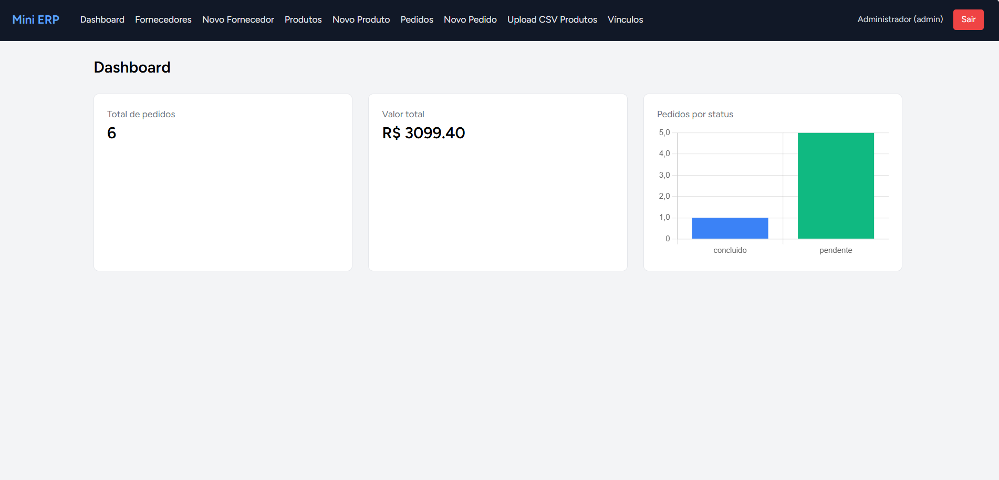
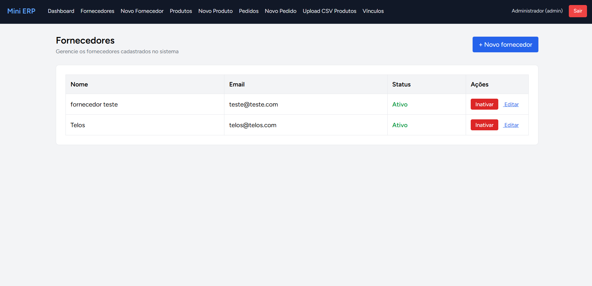
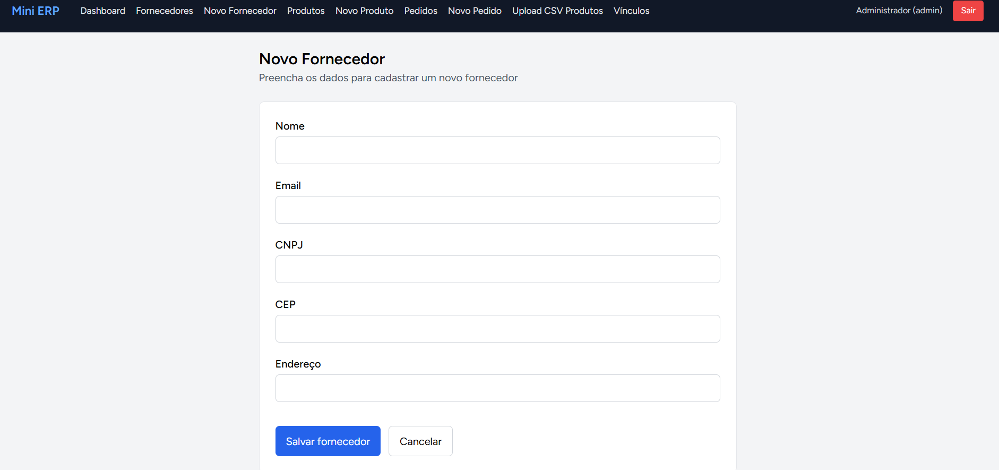
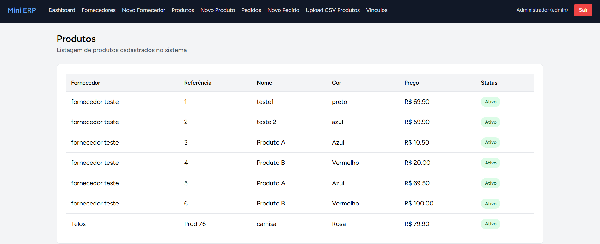
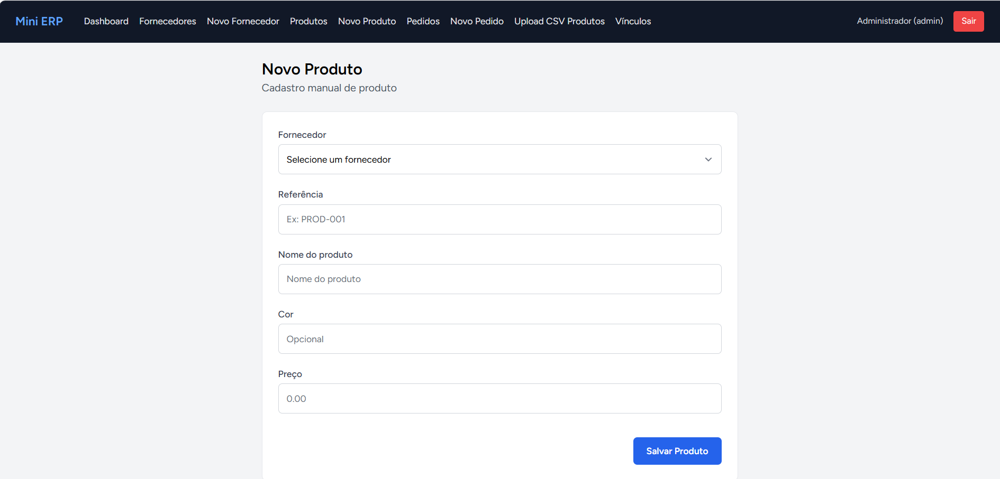
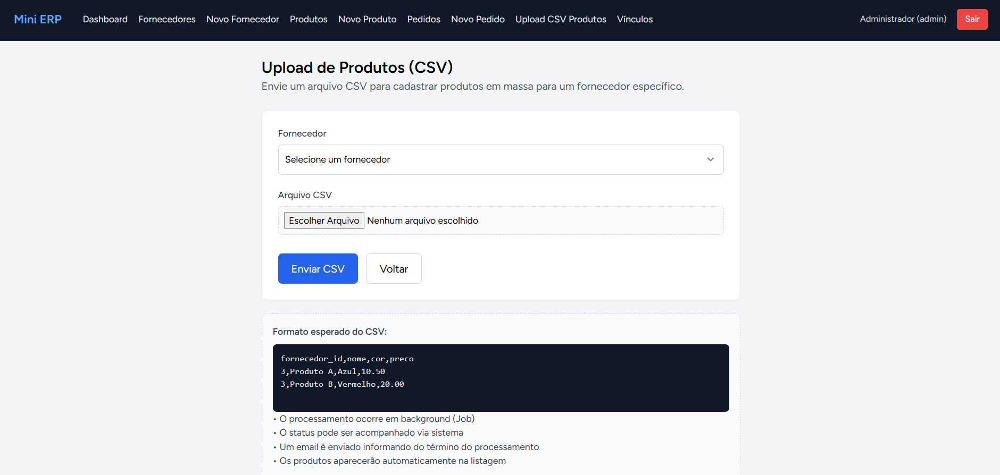
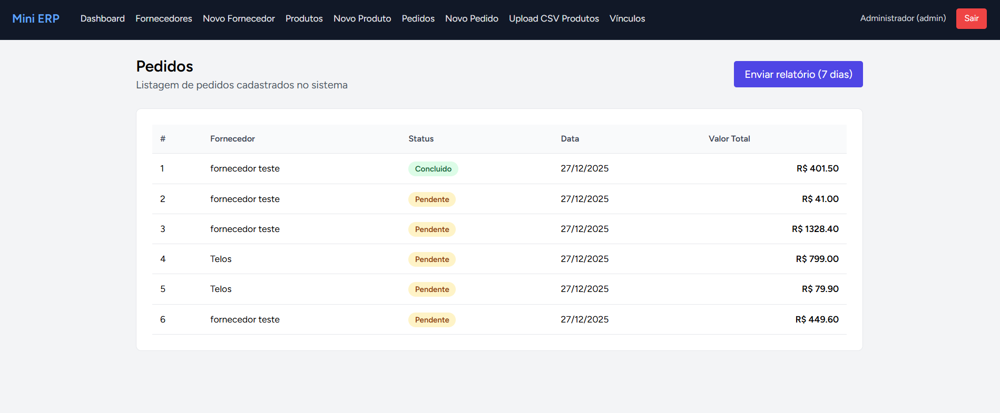
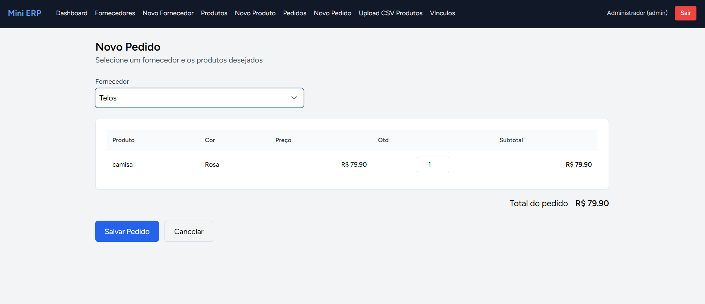
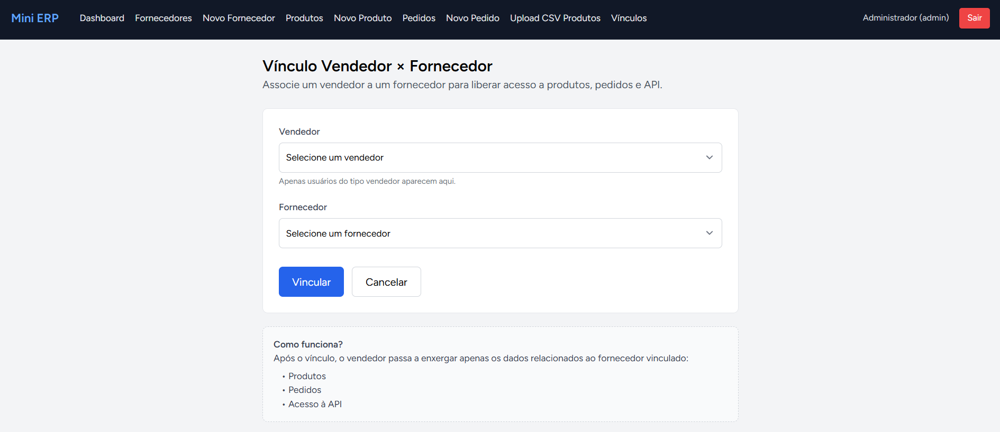

# Mini ERP

## Visão geral

O TelosCRM é um **mini ERP de pedidos para fornecedores**, desenvolvido como parte de um **teste técnico para a vaga de Programador Full Stack**.

A proposta do projeto é simular um fluxo real de ERP, cobrindo desde autenticação e permissões até processamento em background, API e relatórios automatizados.

O sistema contempla:

• Autenticação de usuários
• Controle de permissões (Administrador e Vendedor)
• Cadastro de fornecedores
• Cadastro de produtos (manual e via CSV)
• Cadastro e listagem de pedidos
• API autenticada para pedidos
• Processamento assíncrono com Jobs
• Envio de e-mails
• Relatórios automáticos via agendamento (Cron)
• Dashboard com indicadores e gráfico

---

## Tecnologias utilizadas

• Laravel 12
• Vue 3 + Inertia
• Docker (Laravel Sail)
• MySQL
• Redis
• Chart.js
• Mailpit

---

## Requisitos para rodar o projeto

Antes de iniciar, é necessário ter instalado:

• Docker Desktop
• Git
• Node.js (versão 18 ou superior)
• WSL 2 (caso esteja no Windows)

Não é necessário PHP nem MySQL instalados localmente. Todo o ambiente roda via Docker.

---

## Como rodar o projeto localmente

### 1. Clonar o repositório

Clonar o repositório do GitHub e acessar a pasta do projeto.

Repositório:
https://github.com/silaocabuloso/teloscrm.git

---

### 2. Criar o arquivo de ambiente

Copiar o arquivo .env.example para .env.

O arquivo .env já está configurado para funcionar com o Laravel Sail.

---

### 3. Subir os containers com Docker

Subir os containers utilizando o Laravel Sail.

Isso irá iniciar os seguintes serviços:

• PHP
• MySQL
• Redis
• Mailpit

É possível verificar se os containers estão rodando corretamente utilizando o comando de listagem do Sail.

---

### 4. Instalar dependências do backend

Instalar as dependências do Laravel via Composer usando o Sail.

---

### 5. Gerar a chave da aplicação

Gerar a APP_KEY do Laravel.

---

### 6. Criar tabelas e dados iniciais

Executar as migrations e seeders.

Esse processo:

• Cria todas as tabelas do banco
• Cria o usuário administrador
• Cria um usuário vendedor padrão

---

## Usuários do sistema

### Usuário administrador

Criado automaticamente pelo seeder:

• Email: admin@teloscrm.com
• Senha: password
• Perfil: Administrador

O administrador possui acesso total ao sistema.

---

### Usuário vendedor (via seeder)

Este projeto simula um **ERP interno**, portanto **não existe cadastro público de usuários**.

Os vendedores são criados via **seeder**, representando um cadastro administrativo.

Caso seja necessário recriar o vendedor, existe um seeder específico para isso.

Credenciais do vendedor padrão:

• Email: vendedor@teloscrm.com
• Senha: password
• Perfil: Vendedor

Importante: o vendedor só terá acesso aos dados após estar vinculado a um fornecedor.

---

## Vínculo vendedor × fornecedor

Funcionalidade exclusiva para administradores.

Tela disponível em:
/vinculos

Fluxo:

1. Logar como administrador
2. Selecionar o vendedor
3. Selecionar o fornecedor
4. Clicar em “Vincular”

Esse vínculo controla quais fornecedores, produtos, pedidos e dados de API o vendedor pode acessar.

---

## Funcionalidades principais

### Dashboard

Após o login http://localhost, o sistema apresenta um dashboard com:

• Total de pedidos
• Valor total dos pedidos
• Pedidos agrupados por status
• Gráfico com Chart.js
• Menu de navegação rápida

---

### Fornecedores

• Cadastro
• Edição
• Ativação e inativação

---

### Produtos

• Cadastro manual
• Listagem
• Upload de produtos via CSV

---

### Pedidos

• Criação de pedidos
• Listagem
• Cálculo automático do valor total
• Botão para envio manual de relatório por e-mail

---

## Upload de produtos via CSV

Formato esperado do arquivo:

fornecedor_id,nome,cor,preco
3,Produto A,Azul,10.50
4,Produto B,Vermelho,20.00

Tela disponível em:
/produtos/upload

O processamento do arquivo ocorre via **Job em background**.

---

## Filas (Jobs)

O sistema utiliza filas para:

• Processar upload de CSV
• Enviar e-mails
• Gerar relatórios

Para que essas tarefas sejam executadas, é necessário manter o worker de filas rodando.

---

## Visualização de e-mails

Todos os e-mails enviados pelo sistema podem ser visualizados no Mailpit.

URL:
http://localhost:8025

---

## Relatórios de pedidos (Job + Cron)

### Relatório automático (agendado)

Existe um Job responsável por gerar relatórios de pedidos.

Esse Job está configurado para rodar **todos os dias às 08:00 da manhã**, no horário de São Paulo, utilizando o Scheduler do Laravel.

O relatório é enviado por e-mail e utiliza fila para processamento.

---

### Testar o relatório fora do horário

Para simular a execução do agendamento (cron), é possível executar manualmente o scheduler do Laravel.

Isso dispara exatamente o mesmo Job que rodaria automaticamente às 08h.

---

### Disparo manual do relatório (via interface)

Além do agendamento automático, o sistema possui um **botão na tela de pedidos** que permite:

• Disparar manualmente o envio do relatório
• Executar o mesmo Job utilizado pelo cron
• Facilitar testes e validação da funcionalidade

O envio também ocorre via fila.

---

## Screenshots do Sistema

### Tela de Login

---

### Dashboard

---

### Fornecedores

###  Novo Fornecedor

---

###  Produtos

###  Novo Produto

###  Upload de Produtos via CSV

---

###  Pedidos

###  Novo Pedido

---

###  Vínculo Vendedor × Fornecedor

## API de pedidos

### Autenticação

A API utiliza autenticação via token.

Para obter o token, é necessário realizar login via endpoint de autenticação, informando email e senha de um usuário válido.

A resposta retorna um token que deve ser utilizado nas requisições seguintes.

---

### Header obrigatório nas requisições

Authorization: Bearer SEU_TOKEN
Content-Type: application/json

---

### Endpoints disponíveis

• GET /api/v1/fornecedor/{cnpj}/pedidos
• GET /api/v1/pedidos/{id}
• POST /api/v1/pedidos
• PUT /api/v1/pedidos/{id}
• DELETE /api/v1/pedidos/{id}

Todas as rotas exigem autenticação via token.

---

## Cache (Redis)

O dashboard utiliza cache para melhorar a performance.

Caso seja necessário limpar o cache manualmente, existe um comando específico para isso.

---

## Comandos úteis

• Parar os containers
• Limpar cache e otimizações
• Listar rotas do sistema

---

## Status do projeto

• Todas as etapas do teste foram implementadas
• Sistema funcional
• Código organizado e comentado
• Pronto para avaliação

---

## Autor

Silas Henrique de Oliveira
Teste Técnico — Programador Full Stack

